<h1> Project : Digital Banking backend</h1>
<h2>H2 console login : </h2>
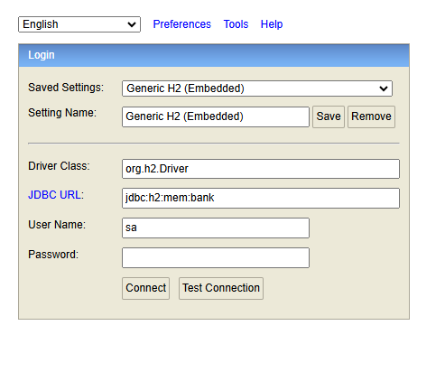
<h2> H2 Database tables : </h2>
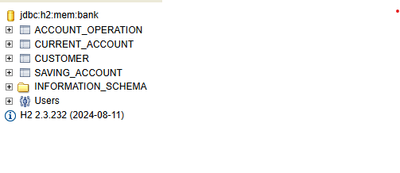
<h2>Current Account : </h2>
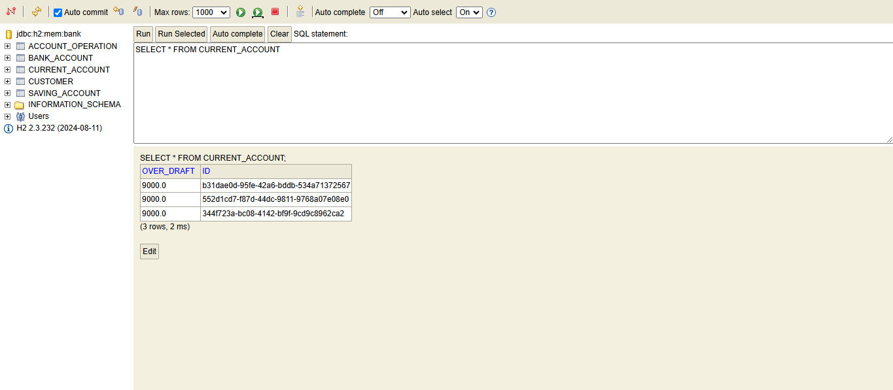
<h2> Saving account : </h2>
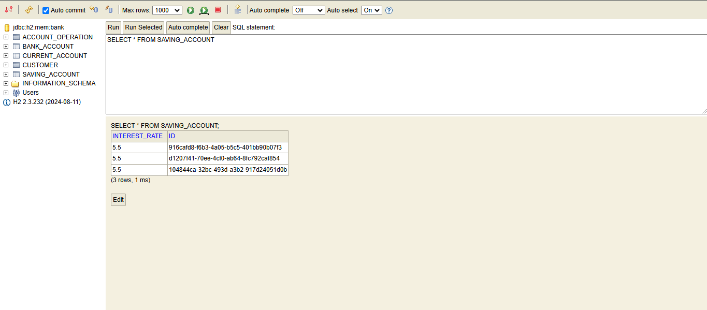
<h2>H2 console tables details : </h2>
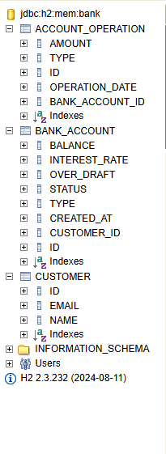
<h2> Customer table : </h2>
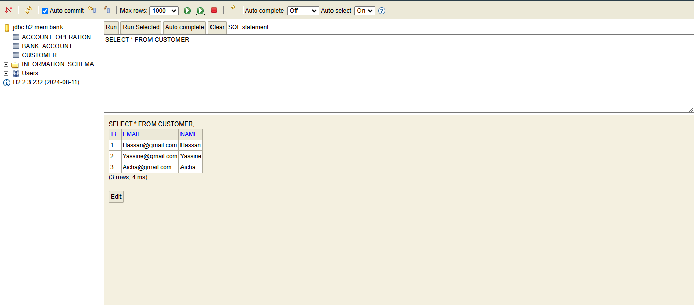
<h2>Account Operation :</h2>
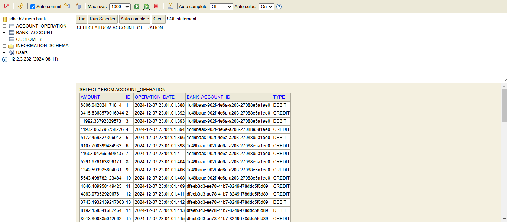
<h2>Bank Account : </h2>
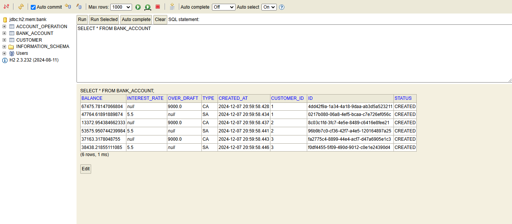
<h2>Terminal Results : </h2>
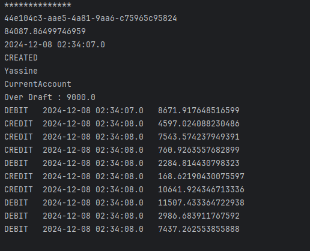
<h2>Affichage de la liste des customers</h2>
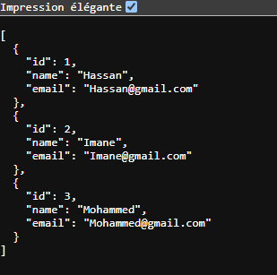
<h2>Affichage de customers à partir de son ID</h2>
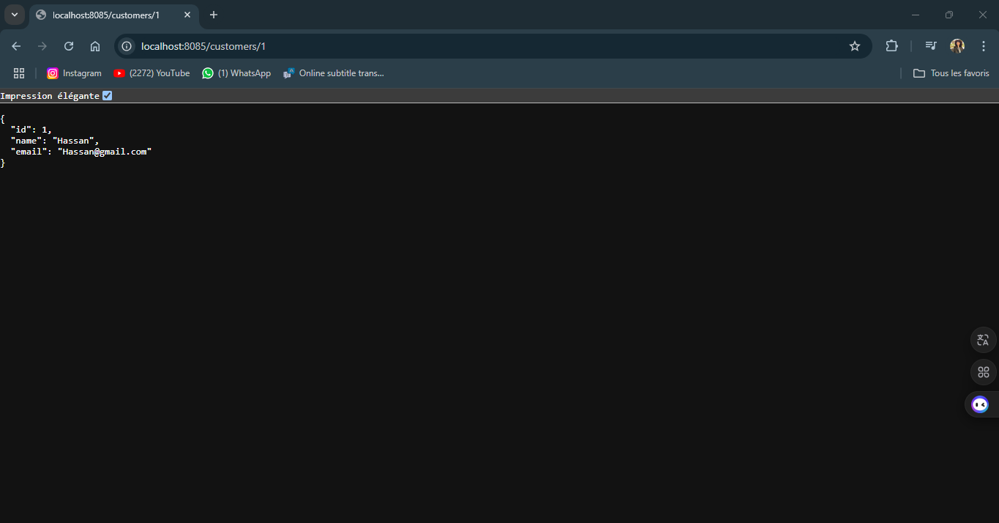
<h2>Php My Admin tables : </h2>
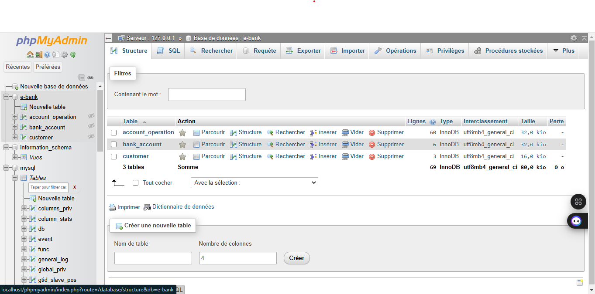
<h2>Php myAdmin customer : </h2>
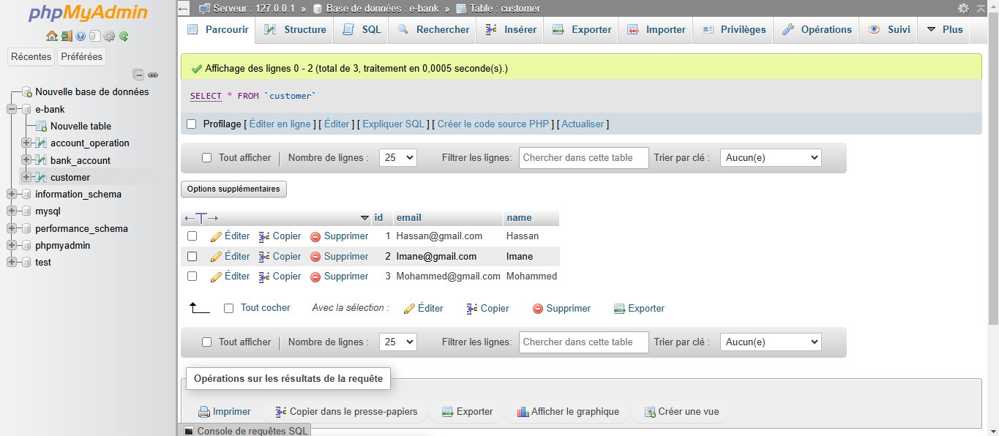
<h2>Bank Account</h2>
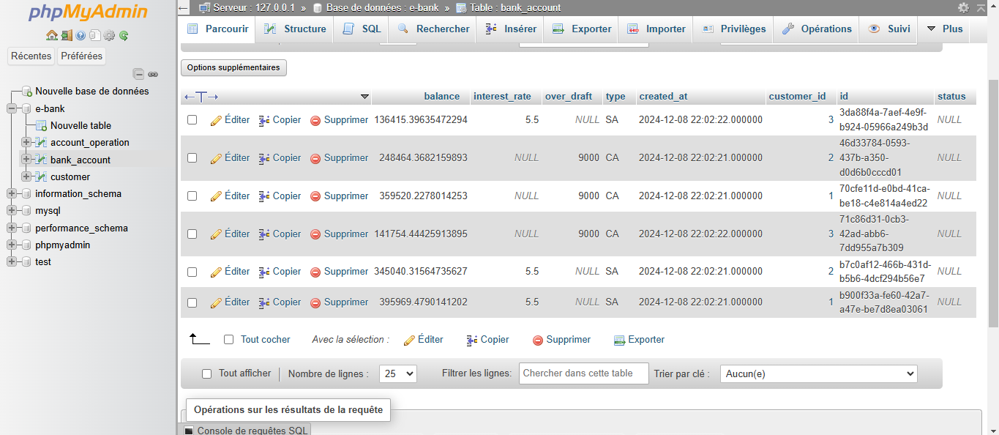
<h2>Account operation : </h2>
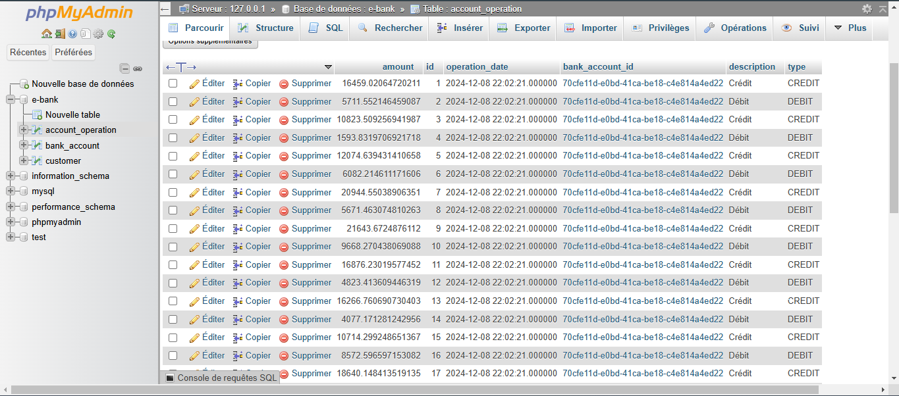
<h2> Affichage d'account Operations </h2>
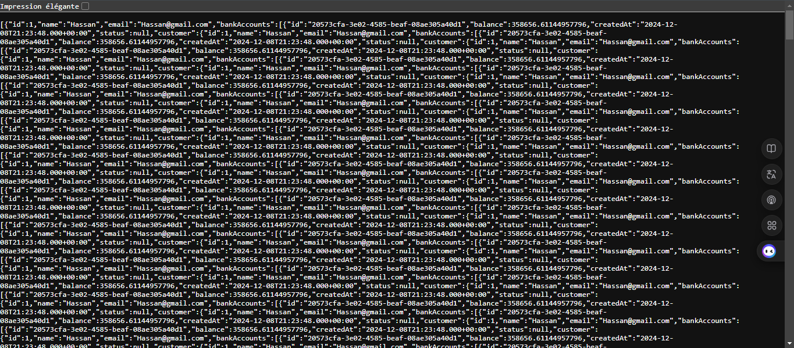
<h2>Terminal Results</h2>
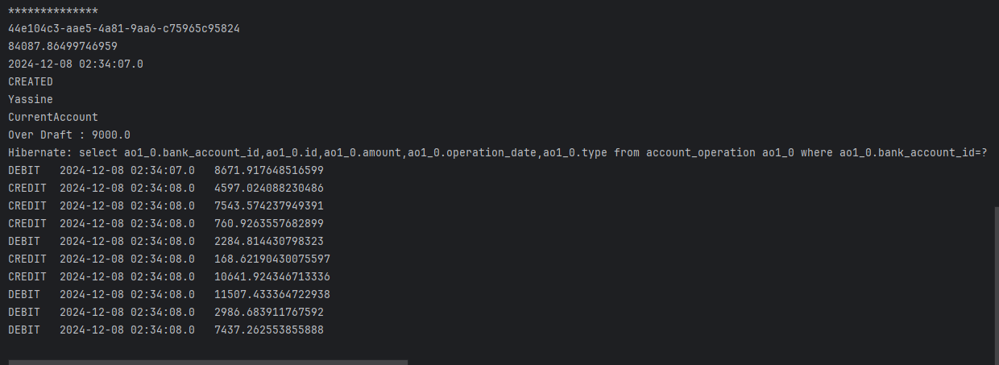
<h2> Affichage du saving accounts : </h2>
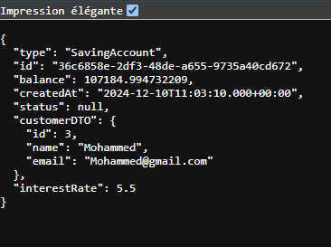
<h2>Affichage du Current accounts :</h2>
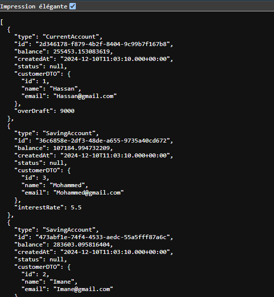
<h2>Affichage du liste des comptes:</h2>
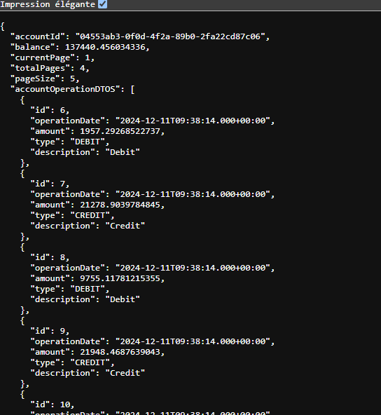
<h2>Affichage de accountOperations : </h2>
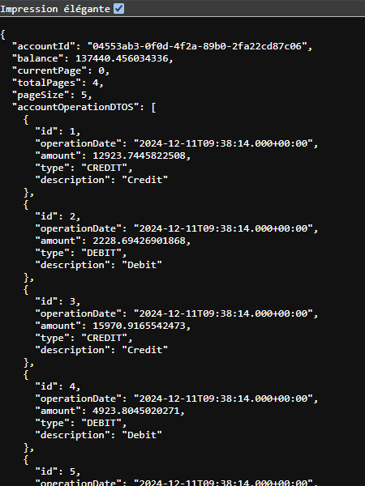

